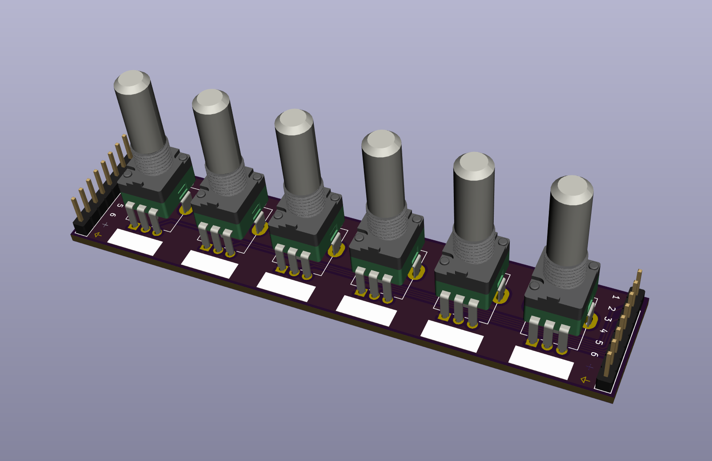
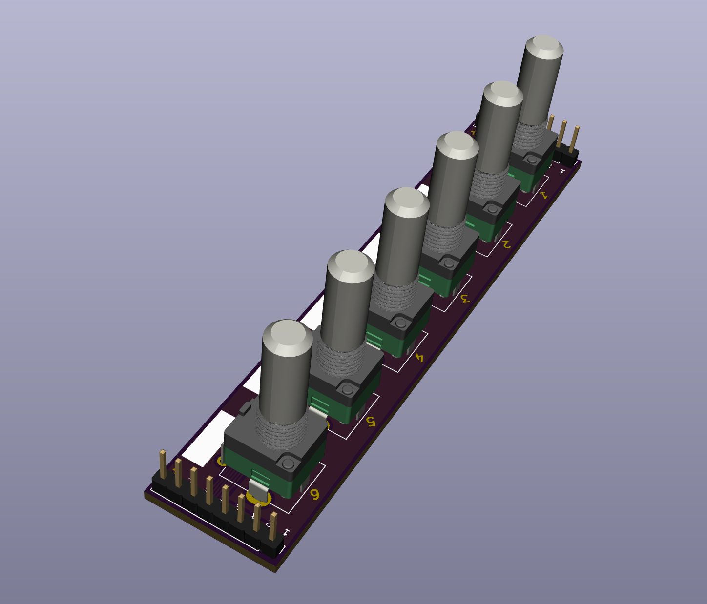

# 6x-potentiometer-prototype
6 potentiometers broken out into a stand alone board for prototyping.

REV2 is best produced with OSHPPARK's Aftferdark Service.

### Each potentiometer is wired up the following:
+ Pin 1: Ground (AGND)
+ Pin 2: accessible via pin socket
+ Pin 3: + (vcc / 3.3v / 5v)

Each potentiometer is accessible via the 3x 1-6 pin socket corresponding to the potentiometer L->R     
GND & voltage available in 4 locations, all common.

Pin sockets are all common and are placed to allow easy configuration above, below, or next to a breadboard.     

See the [schematic](schematic.pdf) for more details.

### Recommended Potentiometers:
+ Alpha vertical 9mm ([thonk](https://www.thonk.co.uk/shop/alpha-9mm-pots-dshaft/)) ([modular addict](https://modularaddict.com/parts/potentiometers-3/9mm-dshaft-vertical-potentiometers))
+ 9mm Tall trimmers ([thonk](https://www.thonk.co.uk/product-category/parts/pot/9mm/9mm-trimmer-pots/)) ([modular addict](https://modularaddict.com/parts/potentiometers-3/9mm-tall-trimmer-potentiometers))

For modular prototyping I suggest using 4x B10K & 2X A10k for linear and logarithmic taper options.

### Recomended jumpers:
+ Square tipped jumpers ([adafruit](https://www.adafruit.com/product/1957))

### Rubber feet
might be nice?

---
REV2   
Build and use at your own risk! I am not responsible for any damage to self or otherwise that arises from using this project!

[CC BY-SA-NC 4.0](https://creativecommons.org/licenses/by-nc-sa/4.0/)     
If you'd like to sell this, contact me.

